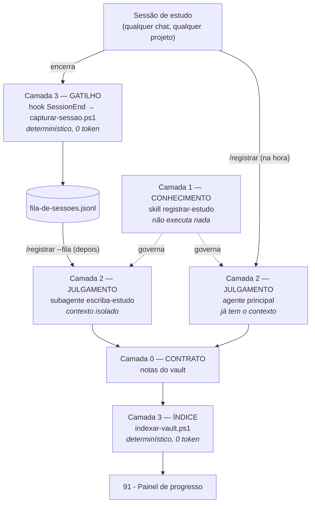

# Como funciona a automação deste vault

Nota de arquitetura do sistema que registra o estudo aqui dentro. Ela existe por
dois motivos: para você saber o que mexer quando algo quebrar, e porque **o
próprio sistema é um exemplo trabalhado do [[50 - Nivel 5 - Agentes e arquitetura|Nível 5]]** — um harness, com as camadas separadas de propósito.

## A pergunta que organiza tudo: é automação ou é agente?

**As duas coisas, e a fronteira entre elas é a decisão de projeto que importa.**

| | Automação determinística | Agente |
|---|---|---|
| O que é | entrada → saída por regra escrita | recebe objetivo, tem ferramentas, decide os passos |
| Custa | nada | tokens, a cada execução |
| Erra | do mesmo jeito, sempre | de um jeito diferente a cada vez |
| Testa como | roda e compara | amostra e avalia |
| Serve para | contar, mover, formatar, disparar | julgar, sintetizar, classificar o ambíguo |

A regra de projeto, e ela é o resumo desta nota inteira:

> **Se você consegue escrever a regra, não use agente.**

Um modelo que conta linhas de frontmatter é caro, lento e ocasionalmente errado
num trabalho que um script acerta 100% das vezes por centavos de nada. Já um
script que tenta decidir "isso foi aprendizado ou foi só configuração de
ferramenta?" vai acertar por acidente. Cada camada abaixo existe de um lado
específico dessa linha.

## As quatro camadas



### Camada 0 — Contrato (dados, não software)

As convenções que já existiam aqui: frontmatter com `tipo`/`status`/`verificado`,
diário por nível, notas atômicas sem acento, contadores `sessoes` e
`horas_acumuladas`. Nada disso é automação — é o **schema**. É o que permite que
uma camada escreva e outra leia sem combinarem nada em runtime.

É o transversal [[01 - Conceitos transversais|Schema como contrato]] aplicado ao
seu próprio vault: a interface entre a parte probabilística (o agente que
escreve) e a parte determinística (o script que conta).

### Camada 1 — Conhecimento: a skill `registrar-estudo`

Um `SKILL.md` em `~/.claude/skills/registrar-estudo/`. **Não executa nada.** É o
procedimento — onde cada tipo de conteúdo vai, quais modelos usar, o que nunca
fazer. Fica em nível de usuário, não do vault, porque o aprendizado acontece em
outros projetos e a skill precisa estar disponível lá.

No vocabulário do Nível 5, é um **guide**: codifica convenção *antes* da ação.

### Camada 2 — Julgamento: onde o agente é inevitável

Duas coisas aqui não têm regra escrevível:

1. **"Isto foi aprendizado ou foi trabalho operacional?"** Um transcript de
   sessão não traz esse rótulo.
2. **"O que, disto tudo, ele efetivamente entendeu — e com que palavras?"**

São classificações sobre linguagem natural ambígua. É exatamente o caso de usar
modelo. Duas rotas, pela mesma razão que existe subagente:

- **`/registrar` durante a conversa** → o agente principal já tem o contexto na
  janela. Delegar seria pedir para alguém reler do zero o que você acabou de
  viver. Ele mesmo escreve.
- **`/registrar --fila`** → sessões antigas, cujo conteúdo **não** está no
  contexto. Aí sim vai para o subagente `escriba-estudo`: ele queima o contexto
  dele lendo transcripts brutos e devolve só o resultado. É
  [[01 - Conceitos transversais|gestão de janela de contexto]], não organograma.

### Camada 3 — Gatilho e índice: os dois pedaços burros de propósito

**O hook `SessionEnd`** dispara ao fim de *toda* sessão. Ele não interpreta nada:
lê o JSON do hook, aplica um filtro grosso (menos de 6 eventos = descartado),
deduplica por `session_id` e anexa uma linha ao `.jsonl`. Zero token. Existe para
uma coisa só: **nenhuma sessão se perde por você ter esquecido de registrar.**

Ele é deliberadamente raso. Poderia chamar `claude -p` e sintetizar ali mesmo —
seria "mais automático" e seria pior: gastaria tokens em toda sessão encerrada,
inclusive nas 90% que não são estudo, sem ninguém olhando o resultado.

**O indexador** lê o frontmatter de todas as notas e regenera o painel: sessões,
horas, conceitos por status, notas com `verificado` vencido nos níveis 5 e 6,
tamanho da fila. Contar e comparar datas tem regra. Nenhum modelo envolvido.

No vocabulário do Nível 5, o indexador é um **sensor**: roda *depois* da ação e
mostra o que aconteceu. E ele torna operacional o Princípio 3 do
[[00 - MOC Roadmap IA]] — "medir é o diferencial" — aplicado ao próprio estudo:
o painel mostra a razão `estudando` / `aplicado`, que é o seu sinal de alerta.

## A unidade de registro é o tópico, não a sessão

O que o sistema rastreia não é "quantas vezes estudei", e sim **quais itens da
checklist `## Conceitos` de cada nível foram fechados**. Toda entrada de diário
ancora num item específico, e fechá-lo marca `- [ ]` → `- [x]` na nota do nível.

Isso dá um número que antes não existia: `3/94` tópicos, quebrado por nível, no
painel. É o que responde "onde eu estou" sem depender de memória.

**Marcar checkbox é uma afirmação sobre o seu conhecimento**, e é você quem vai
usá-la para decidir quando encarar o teste de saída de um nível. Por isso o
critério é estreito de propósito — só marca quando você disse que terminou,
explicou o tópico com as próprias palavras, ou aplicou em código que rodou.
Discutir não fecha. Um contador inflado não te motiva: te cega.

## A tensão que o desenho teve que resolver

O [[02 - Metodo de estudo]] diz, textualmente: *"Escreva com suas palavras, não
com as da fonte. Copiar a explicação derrota o propósito."*

Um agente que redige "O que entendi" por você **é uma nova fonte para copiar**. O
diário fica bonito, o painel enche, e o teste de saída do nível continua
reprovando — porque o que ele mede é justamente a sua capacidade de explicar sem
consultar.

A solução não foi proibir o resumo — foi **separar os dois campos por dono**:

| Campo da entrada | Quem escreve | Para que serve |
|---|---|---|
| `### O que foi coberto na conversa` | o agente | não perder o contexto daqui a seis meses |
| `### O que entendi (minhas palavras)` | só você | é o que o teste de saída cobra |

É a mesma distinção que você já tinha feito entre o diário e a
[[80 - Biblioteca de fontes]] — *"lá fica o que a fonte trouxe; aqui fica o que EU
entendi"* — só que agora dentro da mesma entrada, porque nesta conversa **eu sou
a fonte**.

Por isso a skill e o subagente carregam a mesma restrição dura:

- O agente **transcreve** o que você formulou na conversa, com a sua redação.
- Onde você não formulou, ele deixa a lacuna marcada:

```markdown
> [!todo] Escrever com suas palavras
> (você ainda não formulou isto na conversa)
```

**A lista de lacunas é o entregável real**, não o texto preenchido. Uma sessão em
que você só absorveu vira um diário quase todo em lacunas — e isso é a medida
honesta do quanto você articulou.

É o mesmo raciocínio do `/grill-me` no [[50 - Nivel 5 - Agentes e arquitetura]]:
a IA vale mais forçando você a especificar do que executando no seu lugar.

## Uso

| Quando | Comando |
|---|---|
| Fim de uma sessão de estudo, ainda na conversa | `/registrar` |
| Processar sessões capturadas que ficaram para trás | `/registrar --fila` |
| Só atualizar o painel | rodar `indexar-vault.ps1` |
| Auditar a integridade do vault | rodar `verificar-vault.ps1` |

Nada dispara escrita no vault sozinho. O hook só **captura**; quem escreve é
sempre um agente que você chamou. É a **condição de parada** do Nível 5 aplicada
aqui: um sistema que escrevesse sozinho a cada sessão encheria o vault de ruído
que ninguém revisou.

## Onde mexer quando quebrar

| Sintoma | Onde |
|---|---|
| Formato da nota saiu errado | `~/.claude/skills/registrar-estudo/SKILL.md` |
| Agente registrou sessão que não era estudo | critério em `~/.claude/agents/escriba-estudo.md` |
| Fila não enche | `~/.claude/settings.json` (hook) e `capturar-sessao.ps1` |
| Painel com número errado | `.claude/scripts/indexar-vault.ps1` |
| Regra do vault mudou | `02 - Metodo de estudo` **e** a skill — nessa ordem |

Um detalhe de plataforma que custa meia hora quando pega de surpresa: o Windows
PowerShell 5.1 lê arquivos `.ps1` **sem BOM** como ANSI, e qualquer acento ou
traço longo no script quebra o parser. Os scripts daqui estão salvos em UTF-8
**com** BOM. Se editar um deles em outro editor, preserve o BOM.

## Ideias não implementadas (e por que não)

- **Resumir automaticamente no fim de toda sessão** (`claude -p` dentro do hook):
  gastaria token em toda sessão, inclusive nas que não são estudo, e escreveria
  no vault sem ninguém revisando. O custo real não é o token — é o ruído.
- **Criar as ~60 notas de conceito antecipadamente:** o próprio
  [[02 - Metodo de estudo]] já rejeita — notas vazias são peso morto no grafo.
- **Commit automático a cada registro:** histórico do git vira lixo e você perde
  a chance de revisar antes. O commit continua sendo seu.
